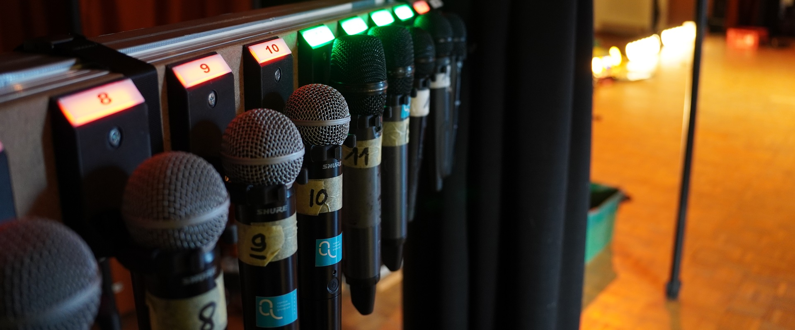

# X32Tally

X32Tally is a DIY microphone status indicator for the behringer X32 / midas M32.

This project serve multiple purpuse:
  - It keep the microphones neatly organized and numbered
  - It retrives mute and fader values from the X32 and displays them on each holders
  - Help stage technicians for microphone distribution & organization
  - Determine if a microphone is in the holder or in someone's hand
  - Display microphone usage in the mixin booth via the web interface

**If you want a super detailed rundown of this project please go my blog article: https://blog.thestaticturtle.fr/microphone-tally-lights/ which details the concept, design, and construction phase thoroughly.**

Otherwise this readme is a small TLDR.

## Software
Everything is separated into different modules that are interconnected with MQTT:

### OSC Module
This module is in charge of forwarding messages from the M32 to the MQTT server so that other modules can access it.
It does not implement the MQTT to M32 side to avoid something writing on the console and potentialy causing something bad

The M32 uses a custom implementation of the [OSC](https://ccrma.stanford.edu/groups/osc/index.html) protocol. Patrick-Gilles Maillot did an incredible job of reverse engineering what each command does and published a [ton of software for the M32](https://sites.google.com/site/patrickmaillot/x32#h.p_rE4IH0Luimc0). He published a [spec sheet](https://drive.google.com/file/d/1Snbwx3m6us6L1qeP1_pD6s8hbJpIpD0a/view) of OSC commands which is very useful.

### Holder microphone detection module
The on stand detection module reads GPIOs every few milliseconds to determine if a microphone is stored on the shelf or in the hand of a performer

The module send message the MQTT server with the topic `modules/stand_buttons/XX/status` with a JSON encoded value for if the microphone is stored on the stand or not

### Tally light modules
The tally light module listens for the `mute` and `fader` values from the OSC module and the `on_stand` module

If the channel is not muted and the fader value is more than `0.08`, then leds are lit up green to indicate that the channel is active otherwise it's lit up red. In addition, if the channel is active and the microphone is still and the stand, the module pulse the LEDs brightness to signal a potential issue.

### WebUI module
The WebUI is a SPA based on VueJS & Vuetify it connects to the MQTT server using websockets. The color, name, icon, mute status and fader value is synced from the OSC module and by extention the console. The On stand detection is synced from the on stand module (if it's not available the icon will stay gray)

See page 139-140 in https://drive.google.com/file/d/1Snbwx3m6us6L1qeP1_pD6s8hbJpIpD0a/view to get the list of icons.

Same as the tally lights, the channel will alert of potential issues. A strip surrounded in blue means that someone has the microphone in his/her hand, but it's still muted. Meanwhile, a yellow border means that it's unmuted on the stand. If a strip doesn't match any of these conditions, the strip reflects the color stored in the X32.

## 3D Files
All 3d files are locaed in the `3d` directory.
 - `Controller` is the box forthe pi zero + pcb + network card
   - `Controller.STL`
 - `MicHolder2` is the microphone holder
   - `MicHolder2.STL` Base
   - `MicHolder2_cover.STL` Led diffuser
 - `GripNut` is the "washer" used to secure the cable in place
   - `GripNut.STL`

## License

X32Tally Copyright (C) 2023 TheStaticTurtle
	
This program is free software: you can redistribute it and/or modify
it under the terms of the GNU General Public License as published by
the Free Software Foundation, either version 3 of the License, or
(at your option) any later version.
	
This program is distributed in the hope that it will be useful,
but WITHOUT ANY WARRANTY; without even the implied warranty of
MERCHANTABILITY or FITNESS FOR A PARTICULAR PURPOSE.  See the
GNU General Public License for more details.
	
You should have received a copy of the GNU General Public License
along with this program.  If not, see <http://www.gnu.org/licenses/>.

