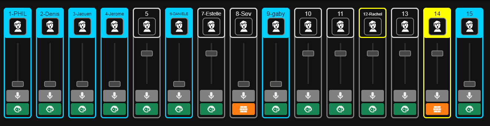

# X32Tally

X32Tally is a DIY microphone rack indicator for the behringer X32 / midas M32

## Working principle

The system is composed of multiple submodules that communicate via MQTT:

### OSC Module
The ocs module connects to the M32 and request some informations:
 - Every 5 seconds:
   - Sends `/xremote` command to subscribe to inputs
 - Every 60sec
   - Sends `/ch/XX/mix/on` to query the mute status of the channel XX
   - Sends `/ch/XX/mix/fader` to query the fader value of the channel XX
   - Sends `/ch/XX/config/icon` to query the icon of the channel XX
   - Sends `/ch/XX/config/name` to query the name of the channel XX
   - Sends `/ch/XX/config/color` to query the color of the channel XX

The module forward **every** osc message to mqtt, with the topic being the address prefixed with `X32`

See these links for more ducomuentation on the X32 OSC protocol:
  - https://sites.google.com/site/patrickmaillot/x32#h.p_rE4IH0Luimc0
  - https://drive.google.com/file/d/1Snbwx3m6us6L1qeP1_pD6s8hbJpIpD0a/view

### On stand detection module

The on stand detection module reads GPIOs every few milliseconds to determine if a microphone is stored on the shelf and not on the hand of the performer

The module send message the MQTT server with the topic `ONSTAND_DETECTION/ch/XX/is_on_stand` with the value `1` if the microphone is stored `0` otherwise

### Tally light modules

The tally light module listens for the `mute` and `fader` values from the OSC module and the `on stand` module

If the channel is not muted and the fader value is more than `0.08`, then leds are lit up green to indicate that the channel is active otherwise it's lit up red.

In addition, if the channel is active and the microphone is still and the stand or the microphone is not active and not on the stand, the module pulse the LEDs brightness to signal a potential issue.

### WebUI module

The WebUI is a SPA based on VueJS it connects to the MQTT server with websockets. The color, name, icon, mute status and fader value is synced from the console. The On stand detection is synced from the on stand module (if not available the icon will stay gray)

See page 139-140 in https://drive.google.com/file/d/1Snbwx3m6us6L1qeP1_pD6s8hbJpIpD0a/view to get the list of icons.

Same as the tally lights, the channel will blink birhgt yellow if the channel is active and the microphone is still and the stand or the microphone is not active and not on the stand.

## Microphone holder

To make this project work, I needed to design a special microphone holder that can detect the microphone precense:

## License

X32Tally Copyright (C) 2023 TheStaticTurtle
	
This program is free software: you can redistribute it and/or modify
it under the terms of the GNU General Public License as published by
the Free Software Foundation, either version 3 of the License, or
(at your option) any later version.
	
This program is distributed in the hope that it will be useful,
but WITHOUT ANY WARRANTY; without even the implied warranty of
MERCHANTABILITY or FITNESS FOR A PARTICULAR PURPOSE.  See the
GNU General Public License for more details.
	
You should have received a copy of the GNU General Public License
along with this program.  If not, see <http://www.gnu.org/licenses/>.

